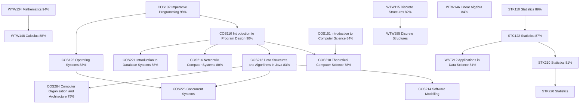

# Johan Nel: BSc (IT in IKS) II at the University of Pretoria

Hi there! I'm Johan, a second-year BSc (Information Technology in Information and Knowledge Systems: Data Science) student at the University of Pretoria. This degree allows me to major in Computer Science and partial major in Data Science. 

## Academic Information

### Visualisation:

Below is a visual representation of my academic journey so far:

### Study Information:

- Year 1 Cumulative weighted average: 89.75%
- I am currently busy with my second year of study.

### Academic Awards:
- **Dean's Merit List 2024:** Issued by Faculty of Engineering, Built Environment & IT at the University of Pretoria
- **Runner-up for the Top First-Year Computer Science Student 2024:** Issued by School of Information Technology at the University of Pretoria
- **Top 5 Grade 12 Learner in the Gert Sibande District:** Issued by Mpumalanga Department of Basic Education
- **Overall academic top achiever in Grade 11 and 12 at Hoërskool Secunda:** Issued by Hoërskool Secunda

## Interests and Skills:

### Interests:
My interests include:
- Applied Statistics and Machine Learning
- Data Visualization
- Backend Systems
- Database Design
- API Development, Integration and Documentation

### Skills:
I am proficient in:
- Delphi
- Java
- C++
- Python
- R

