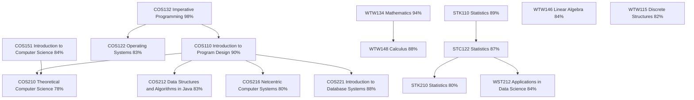

# Johan Nel — BSc (IT in IKS) at the University of Pretoria

Hi there! I'm Johan, a second-year BSc (Information Technology in Information and Knowledge Systems: Data Science) student at the University of Pretoria. I'm passionate about computer science, mathematics, and data-driven problem solving.

I was honoured as the runner-up for Best First-Year Computer Science Student by the School of IT at the University of Pretoria.

## Academic Performance

Below is a visual representation of my academic journey so far:

## Skills and Interests

### Skills:
I am proficient in:
- Delphi
- Java
- C++
- Python
- R

### Interests:
- Applied Statistics and Machine Learning
- Data Visualization
- Backend Systems
- Database Design
- API Development, Integration and Documentation
